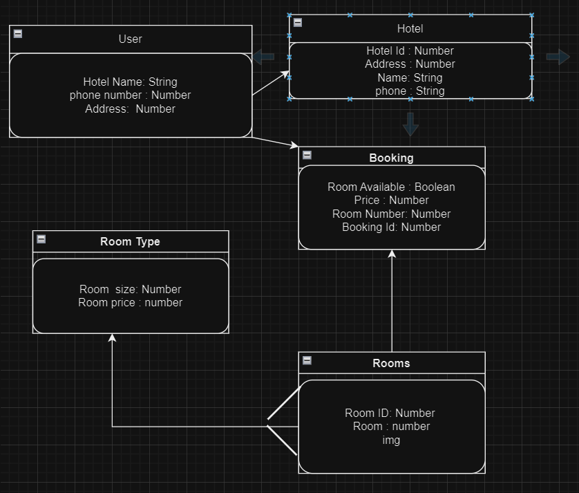

# Project2 - Hotel Booking System

## Overview

This project is a Hotel Booking System built using Express.js, Node.js, MongoDB, HTML, and CSS. It provides users with the ability to book hotel rooms, and perform CRUD (Create, Read, Update, Delete) operations on both bookings and User info. Additionally, an admin role is implemented to manage hotel the app, including the addition of new rooms and pictures.

## Features

- **Guest User Functionality:**
  - **Book Hotels:** Users can browse available rooms, view room details, and make bookings.
  - **Edit Bookings:** Users have the ability to edit their previously submitted bookings.
  - **Delete Bookings:** Users can delete their bookings.

- **Admin Functionality:**
  - **Add New Rooms:** Admins can add new rooms to the hotel inventory.
  - **Manage Pictures:** Admins have the ability to upload and manage pictures for each room.
  - **Delete:** Admins can delete rooms, bokings and guest users.
  - **Edit/Update:** Admins have the ability to edit and update rooms, images and user information.
  - **Authorize:** Admins have the ability to provide admin authorization to guest users.

  

## Technologies Used

- **Express.js and Node.js:** The server-side framework and runtime for building the backend of the application.
- **MongoDB:** The NoSQL database used for storing hotel and user data.
- **HTML and CSS:** Frontend technologies used for designing and rendering the user interface.

## Authentication Strategy

- **Google OAuth 2.0:** Passport strategy for Google OAuth 2.0.

## Usage

- **User Access:**
  - Visit the homepage, browse available rooms, and make bookings.
  - Change and update their user details and avatar.
  - Edit or delete their bookings.

- **Admin Access:**
  - Access the admin panel.
  - View, edit, delete, and add new rooms to the hotel inventory.
  - View, edit, delete, and add new room types to the hotel inventory.
  - View, edit, delete, and add new booking to the hotel inventory.
  - View, edit, and delete users and change their roles.
  - Upload and manage pictures for each room type and user.

## Links

- **Trello Board:**
  - https://trello.com/b/CGwKl6mc/my-trello-board

- **WireFrame:**
  - https://www.figma.com/file/fRCqqoOwY2DOUhBmVqnNVH/Hotel-Booking-System?type=design&node-id=0%3A1&mode=design&t=kWU82jGpOHfh3Uku-1

## Entity Relationship Diagram

## Unsolved Problems

- None

## Future Enhancements

- Change the UI design.
- Add Ajax API for the booking form, to make it a one step process.
- Add more pages, like contact us, about us, etc.
- Adjust the sitemap to get a better UX and meet best practices.
- Add review and payment pages.